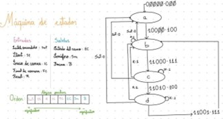

# MazeBot: Vehículo Embebido de Navegación Remota para Resolución de Laberinto
## Proyecto de Embebidos – Sistema Móvil
**Autores:**  
- Aceldo Torres María Grazia | maactorr@espol.edu.ec  
- Romero Lambogglia Christopher Ariel | chrarome@espol.edu.ec  

## I. INTRODUCCIÓN
Este documento presenta el diseño y desarrollo de MazeBot, un sistema interactivo basado en un vehículo controlado remotamente mediante una aplicación móvil. Su propósito es brindar una experiencia lúdica y educativa, integrando tecnologías como sistemas embebidos, comunicación Wi-Fi, transmisión en tiempo real con ESP32-CAM y una interfaz accesible desarrollada en MIT App Inventor. El usuario guía al MazeBot a través de un laberinto físico, mientras el sistema transmite video en vivo y registra datos de desempeño como tiempo de recorrido, puntuación y trayectoria. Además, se busca estimular habilidades cognitivas relacionadas con la orientación espacial, la toma de decisiones y la planificación estratégica. El diseño considera inclusión al implementar control por voz, permitiendo la participación de personas con movilidad reducida. A nivel técnico, MazeBot utiliza una arquitectura compacta y eficiente con motores DC, sensores infrarrojos (IR), módulos de gestión de baterías (BMS) y reguladores de voltaje que garantizan seguridad y autonomía. Sus objetivos incluyen desarrollar una aplicación intuitiva y construir un prototipo funcional que demuestre la aplicación de sistemas embebidos en el presente proyecto.

El usuario guía al MazeBot a través de un laberinto físico (https://github.com/dankewos/ProyectoDeEmbebidos2.git), mientras el sistema transmite video y registra métricas de desempeño. Se busca estimular habilidades cognitivas relacionadas con la orientación espacial, la toma de decisiones y la planificación estratégica. La inclusión se promueve mediante **control por voz** para usuarios con movilidad reducida.

## Configuración ESP32-CAM (incluida en este repo)
- **Modelo de cámara:** AI-Thinker (preconfigurado).
- **GPIO asignados**
  | Señal | GPIO |
  |------|------|
  | IN1  | 13   |
  | IN2  | 15   |
  | IN3  | 4    |
  | IN4  | 14   |
- **Sensor de contacto:** pin **configurable** (por defecto: documentado en el código).
- **Alimentación:** pines **5V** (entrada a regulador/driver), **3.3V** (lógica), y **GND** comunes.
- **Wi-Fi:** modos **STA** (credenciales y SSID/AP definidos en el código).
- **Entorno:** `platformio.ini` preparado para **ESP32-CAM** (board `esp32cam`), con monitor serie a 115200 baudios.

---
## Requisitos
- **Visual Studio Code** + extensión **PlatformIO**.
- Cable USB-TTL / programador compatible con ESP32-CAM.
- **Firebase** para registro de datos.
-  **EasyEDA** (PCB).

---

## Puesta en marcha rápida
```bash
# 1) Clonar
git clone https://github.com/dankewos/ProyectoDeEmbebidos.git
cd <repo>

# 2) Abrir en VS Code y compilar con PlatformIO
#    PlatformIO: Build → Upload → Monitor Serial (115200)

# 3) Conectar la app móvil
#    - Modo STA: ambos dispositivos en la misma red Wi-Fi
```

## II. ALCANCE Y LIMITACIONES
### A. Alcance
- **Sistema MazeBot (Hardware y Electrónica):**: El proyecto comprende un robot móvil diferencial diseñado para desplazarse dentro de un laberinto controlado, permitiendo ejecutar tareas de exploración, recorrido y resolución de trayectorias. Su funcionalidad principal es ofrecer una experiencia lúdico-educativa en la que los usuarios puedan interactuar con el entorno, considerando accesibilidad mediante controles simples e inclusión al permitir su uso por distintos perfiles de estudiantes. Incluye un robot móvil diferencial con ESP32-CAM, motores DC, baterías 18650 con módulo BMS y un regulador de voltaje. Todo se integra en una PCB compacta, diseñada para facilitar ensamblaje y operación eficiente. El MazeBot opera en una maqueta de laberinto que constituye su entorno de prueba.  
- **Interfaz de Usuario:** (Aplicación móvil y control): La aplicación, desarrollada en MIT App Inventor, permite control remoto mediante botones direccionales o comandos de voz. Integra transmisión de video en tiempo real, configuración del juego y visualización de estadísticas personalizadas.  
- **Detección y Retroalimentación:** Emplea sensores IR en la entrada y salida del laberinto para detectar inicio y fin de recorrido. Se registran métricas como tiempo total, cantidad de giros, puntuación por stickers y se genera una gráfica de la trayectoria, ofreciendo retroalimentación visual y cuantitativa.
- **Orientación Educativa e Inclusiva:** El sistema está orientado principalmente a alumnos de colegio como herramienta para aprender y practicar actividades cognitivas relacionadas con la planificación, la memoria y la resolución de problemas. No obstante, cualquier persona puede utilizarlo con fines recreativos o de entrenamiento cognitivo. El control por voz constituye una función inclusiva que amplía la accesibilidad del sistema.
---

### B. Limitaciones
- Respecto a funcionalidad: El MazeBot depende completamente del control manual; no integra navegación autónoma ni algoritmos de resolución de laberintos. Tampoco implementa visión computacional avanzada para identificación de objetos de interés. Además, depende bastante de la conexión a la red puesto que funciona con WiFi, pero no como AccessPoint.
- Entorno: El sistema está diseñado exclusivamente para interiores, sin protección contra polvo, humedad o interferencias externas, por lo que su uso está limitado a ambientes hostiles.
- Almacenamiento: Actualmente no incluye integración en la nube ni almacenamiento permanente, aunque se contempla como posible mejora futura para análisis remoto o historial de partidas.

---

## III. DIAGRAMAS EXPLICATIVOS
### A. Diagrama de contexto


Figura 1. Diagrama de contexto del sistema.

El diagrama de contexto de la Figura 1 representa la interacción general entre el sistema y los actores externos que lo rodean. En la esquina superior izquierda se encuentra el MazeBot, un robot autónomo con capacidades de transmisión de video, detección mediante sensores y control remoto. El principal actor externo es el usuario, quien interactúa con el robot a través de una aplicación móvil desarrollada en MIT App Inventor. Esta app se comunica vía Wi-Fi con el MazeBot, enviando comandos de movimiento y recibiendo imágenes en tiempo real. El entorno físico, representado por el laberinto en el centro del diagrama, también influye directamente en el comportamiento del MazeBot, ya que contiene sensores fijos que colaboran con la detección de eventos clave ya que el sistema registra eventos como el inicio y fin del recorrido, así como estadísticas de tiempo, que pueden visualizarse desde la app. 

### B. Diagrama de bloques


Figura 2. Diagrama de bloques del sistema Móvil de MazeBot

El diagrama de bloques del MazeBot presenta la arquitectura electrónica del vehículo que recorre el laberinto. En el centro se encuentra el ESP32-CAM, el microcontrolador del sistema móvil, responsable de recibir comandos, controlar los actuadores y transmitir video en tiempo real. A su izquierda, se muestra el sistema de alimentación, compuesto por dos baterías 18650, un interruptor, un módulo de protección de baterías y un regulador de voltaje que permitirá administrar los 5V que necesita el microcontrolador. Es alimentado con dos baterías de litio de 3.7V y 4200mAh conectadas en serie por lo que recibe aproximadamente 7.4V y, dado que el sistema en total y en movimiento consume entre 600 y 1000mA, durará un máximo 4 horas y 30 minutos.
Hacia la derecha del microcontrolador, se conectan los sensores de contacto, que permiten detectar colisiones o interacciones del carrito con las paredes del laberinto. También se incluye un driver L298N, que controla el movimiento de los motores DC que impulsan al MazeBot. Toda esta información y actividad del sistema es registrada en una base de datos remota mediante comunicación WiFi, el microcontrolador se encuentra en modo STA (Station), y además envía y recibe comandos HTTP para el control del MazeBot y la retroalimentación del usuario lo que permite llevar un control estadístico del rendimiento del carrito y su interacción con el entorno. En conjunto, el diseño asegura un funcionamiento autónomo, estable y conectado del vehículo.

### C. Máquina de estados del MazeBot


Figura 3. Diagrama de estados del sistema

La Figura 4 muestra el diagrama de estados diseñado para el control del sistema general. El modelo contempla cuatro estados principales: a, b, c y d, cada uno asociado a combinaciones específicas de entradas (Start, Inicio de carrera, Fin de carrera y Reset). Desde el estado inicial a, al activarse la señal de inicio (St=1), el sistema transita a b, donde se habilita la salida del carro (EC=1). Posteriormente, las condiciones de sensores de carrera determinan las transiciones hacia los estados c y d, en los cuales se controlan el semáforo (Sm) y la barrera (B). Finalmente, ante la señal de reinicio (R=1), el sistema retorna al estado inicial. En conjunto, este diagrama describe el comportamiento secuencial del sistema, asegurando que las acciones de apertura, paso y cierre se realicen en orden lógico y seguro.

### D. Diagrama de interfaces 


Figura 5. Diagrama de interfaces que muestra la interacción entre componentes y subsistemas

Este diagrama representa la comunicación y relación entre los distintos subsistemas del MazeBot. El MazeBot y la maqueta del laberinto se encuentran conectados entre sí a través de una base de datos central, que actúa como puente de información mediante Wi-Fi. El carro envía datos de su recorrido y estado, mientras que la maqueta detecta eventos clave (inicio y fin) y proporciona retroalimentación visual y auditiva al usuario. De esta forma, ambos subsistemas trabajan de manera coordinada para registrar, procesar y comunicar la información necesaria para la interacción en tiempo real dentro del entorno del laberinto.

---

## IV. ALTERNATIVAS DE DISEÑO
En la selección del microcontrolador se evaluaron tres alternativas: ESP32-CAM, Arduino UNO con WiFi Shield y Raspberry Pi Zero W. El análisis incluyó criterios de costo, consumo energético, capacidad de procesamiento, memoria, conectividad y facilidad de integración. El ESP32-CAM fue finalmente elegido por su excelente relación costo-beneficio, ya que por un precio reducido integra Wi-Fi y cámara en un solo módulo, lo reduce la complejidad de diseño y los posibles puntos de fallo. Además, ofrece un consumo energético más bajo en comparación con las otras opciones y un rendimiento superior al Arduino UNO, gracias a su procesador dual-core de 240 MHz y 520 KB de SRAM. Frente a la Raspberry Pi Zero W, aunque esta última cuenta con mayor potencia de procesamiento y memoria, el ESP32-CAM resulta más eficiente, compacto y sencillo de programar, lo que lo convierte en la opción más adecuada para un sistema móvil como el MazeBot, donde la ligereza, la autonomía y la simplicidad de implementación son factores clave.

Para la alimentación, se seleccionaron dos baterías 18650 en serie (7.4V, 4200mAh), que ofrecen suficiente capacidad y corriente de descarga para los motores y el sistema. Se descartaron opciones como PowerBanks y baterías AA por limitaciones de corriente y autonomía, y las LiPo por requerir cargadores especializados.

El sistema incluye un módulo BMS TP4056 con protecciones contra sobrecarga, sobre descarga, cortocircuitos y sobrecalentamiento, garantizando seguridad y prolongando la vida útil de las baterías. En cuanto a la comunicación, se optó por utilizar el modo Station (STA) del ESP32, ya que permite conectar el MazeBot a una red Wi-Fi local para acceder a servicios en la nube como Firebase y garantizar un control remoto estable. Sin embargo, se considera que en futuras versiones el uso del modo dual AP/STA sería especialmente útil: el dispositivo podría crear su propia red para la configuración inicial o como respaldo en caso de pérdida de conexión a internet, asegurando redundancia y menor latencia en los comandos críticos.

Finalmente, para el control de motores se seleccionó el driver L298N por su capacidad de manejar corrientes de hasta 2A por canal, su bajo costo y amplia disponibilidad. Aunque existen alternativas más eficientes como el DRV8833, su mayor costo y menor accesibilidad local hicieron que el L298N resultara más adecuado, implementando control de velocidad mediante PWM a 1kHz.

---

## V. PLAN DE TEST Y VALIDACIÓN
El plan de pruebas TP-MAZEBOT tiene como objetivo verificar que el prototipo MazeBot cumple con sus funcionalidades clave, como el control remoto desde la app, la transmisión de video en tiempo real, la detección de eventos mediante sensores y el registro de estadísticas. El alcance se centra en evaluar la interacción del usuario con el robot mediante comunicación Wi-Fi, la respuesta de los sensores infrarrojos, la recolección de datos del recorrido y el monitoreo del consumo energético del sistema.

Las métricas de validación incluyen: Verificación de conexión a la base de datos, lecturas en tiempo real de la base de datos (inst.). Inicialización de servidor de cámara, latencia promedio de transmisión de video (ms), tiempo total de recorrido (s), detecciones exitosas de sensores IR (estate 0/1) y estabilidad de la conexión Wi-Fi (tiempo medio de reconexión en caso de falla) delays.

La estrategia de prueba consiste en realizar pruebas funcionales en una maqueta física que simula condiciones reales de uso, incluyendo recorridos completos y detección de stickers. Estas pruebas se repetirán en diferentes escenarios para evaluar la fiabilidad del sistema. Se requieren recursos como el MazeBot ensamblado, la app móvil desarrollada en MIT App Inventor, una maqueta de laberinto, fuente de alimentación estable y herramientas de monitoreo. Se consideran riesgos como fallos en sensores, desconexión Wi-Fi y sobrecalentamiento, con medidas de mitigación específicas. Además, el correcto funcionamiento depende de una conexión Wi-Fi estable, un smartphone Android y el firmware adecuado en la ESP32-CAM.

---

## VI. CONSIDERACIONES TÉCNICAS
El proyecto MazeBot incorpora principios éticos fundamentales en su diseño y uso, priorizando la accesibilidad, la privacidad de los usuarios, y el impacto social positivo. La inclusión se promueve mediante el control por voz, permitiendo que personas con movilidad reducida interactúen con el sistema. En cuanto a la privacidad, aunque actualmente no se almacena información en la nube, se considera implementar medidas de cifrado y control de acceso para proteger futuras estadísticas y datos de recorrido.

En cuanto a la privacidad, aunque actualmente no se almacenan datos de usuarios, se contempla integrar protocolos de cifrado AES y autenticación por contraseña o token para garantizar la protección de futuras estadísticas.
Además, se asegura la seguridad eléctrica del sistema mediante el uso de BMS, reguladores de voltaje y pruebas de estrés para evitar fallos como sobrecalentamientos o cortocircuitos. El propósito del MazeBot es estrictamente educativo, evitando usos comerciales o monetización que desvíen su objetivo formativo. Además, su diseño transparente y completamente documentado permite la réplica y mejora del sistema por parte de otros, fomentando una cultura de aprendizaje abierto y ético dentro del ámbito de la ingeniería.

Finalmente, se proyecta como línea futura de innovación la integración de algoritmos de visión computacional y navegación autónoma en el MazeBot, lo cual permitiría resolver laberintos sin intervención humana. Esta evolución consolidaría el prototipo como una plataforma versátil para investigación en inteligencia artificial embebida y robótica educativa.

---

## VII. REFERENCIAS
[1] D. Zhu, S. Roy, Z. Liu, H. Weller, W. J. Parak y N. Feliu, “Remotely controlled opening of delivery vehicles and release of cargo by external triggers,” Advanced Drug Delivery Reviews, vol. 138, pp. 117–132, ene. 2019, doi: 10.1016/j.addr.2018.10.003.

[2] G. Galeano, Programación de sistemas embebidos en C: teoría y prácticas aplicadas a cualquier microcontrolador, 1ª ed. México: Alfaomega Grupo Editor, 2011. ISBN: 978-958-682-770-6.

[3] E. J. Chancay Sancán Quimis, “Implementación de fuente de alimentación dual”, Tesis de ingeniería, Universidad Estatal del Sur de Manabí (UNESUM), 2024.

[4] P. F. Salazar, “Análisis de la seguridad del protocolo de transporte MQTT en dispositivos para internet de las cosas,” Trabajo de grado (Especialización en Seguridad Informática), Universidad Nacional Abierta y a Distancia (UNAD), 2024.

